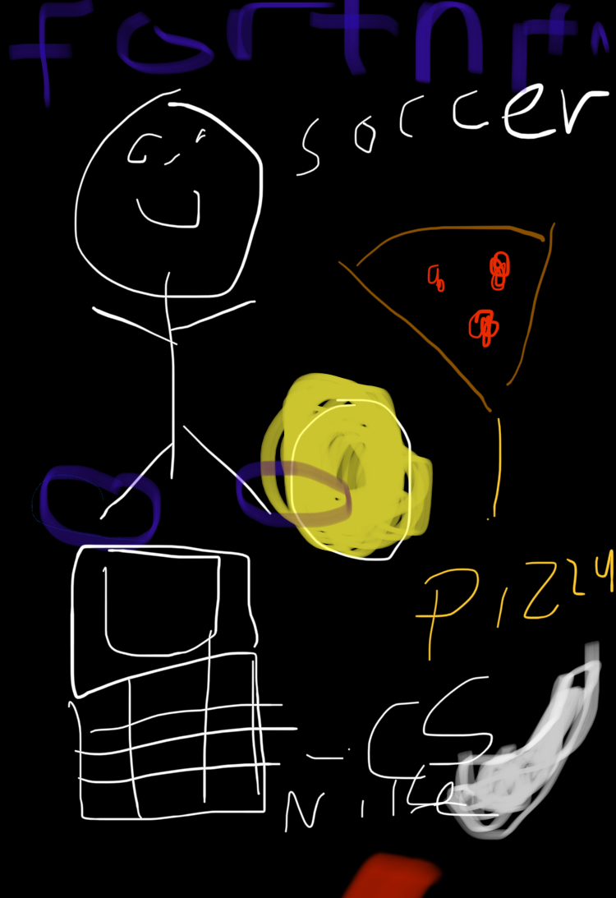

## Akshay Nagesh's Page
Go to my [github account](https://github.com/AkshayNagesh)

## About Me
Hi, my name is Akshay Nagesh. I am 15 years old. I am a hard working person who loves to code. A little about me is I am a huge fan of soccer, and my favorite soccer team is Manchester City. My favorite soccer player is Christiano Ronaldo. Not only I a soccer fan, but I also love to play soccer, I play competetive for a team called Force. I also enjoy cooking, tennis, ping pong, and haning out with family and friends. I am really excited to be taking AP CSP this year. 
Blogging in GitHub pages is a way to learn and code at the same time. 

### My Interests 

![]

## About Me Freeform Picture

## Overview of Hacks, Study, and Tangibles 

- Plans, Lists, [Scrum Boards](https://clickup.com/blog/scrum-board/) help you to track key events, show progress and record time.  Effort is a big part of your class grade.  Show plans and time spent!
- [Hacks(Todo)](https://levelup.gitconnected.com/six-ultimate-daily-hacks-for-every-programmer-60f5f10feae) enable you to stay in focus with key requirements of the class.  Each Hack will produce Tangibles.
- Tangibles or [Tangible Artifacts](https://en.wikipedia.org/wiki/Artifact_(software_development)) are things you accumulate as a learner and coder. 
